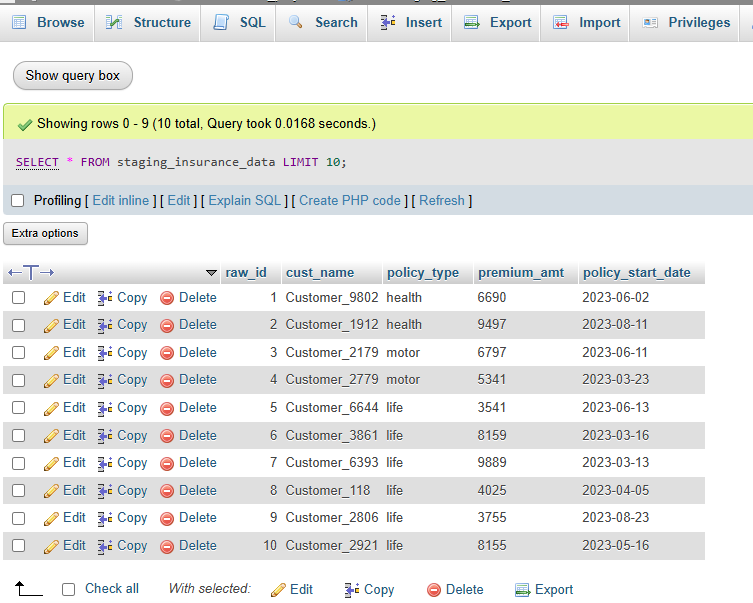
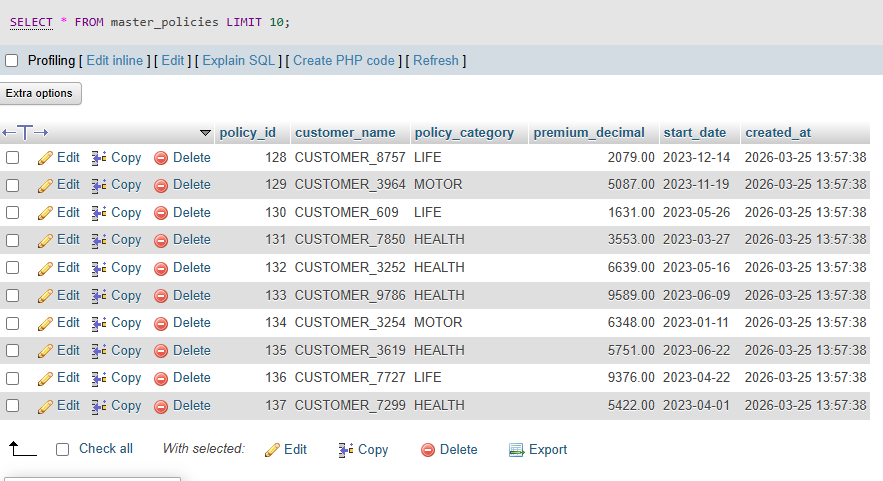
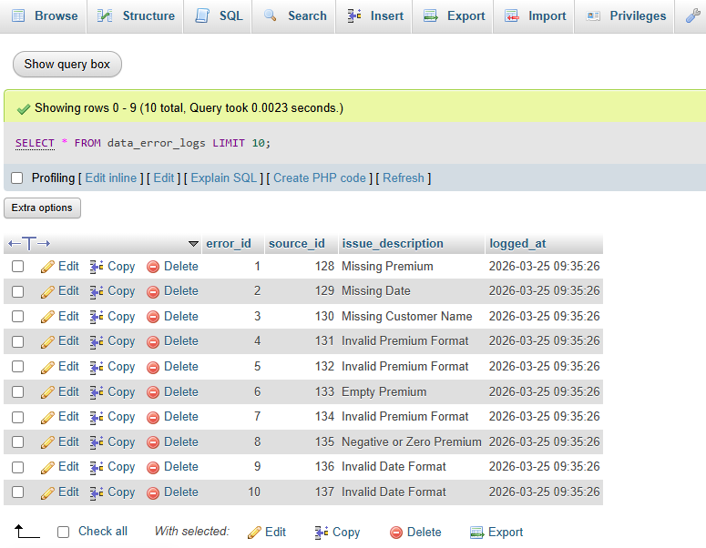
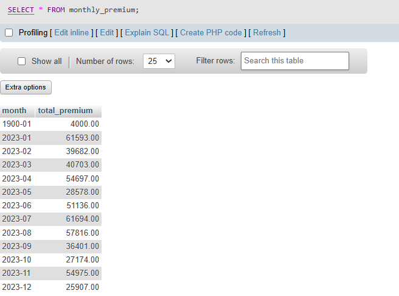
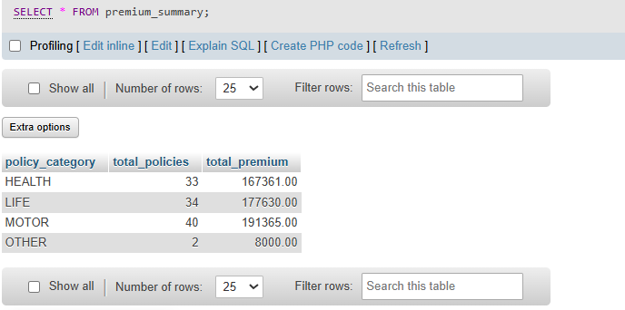
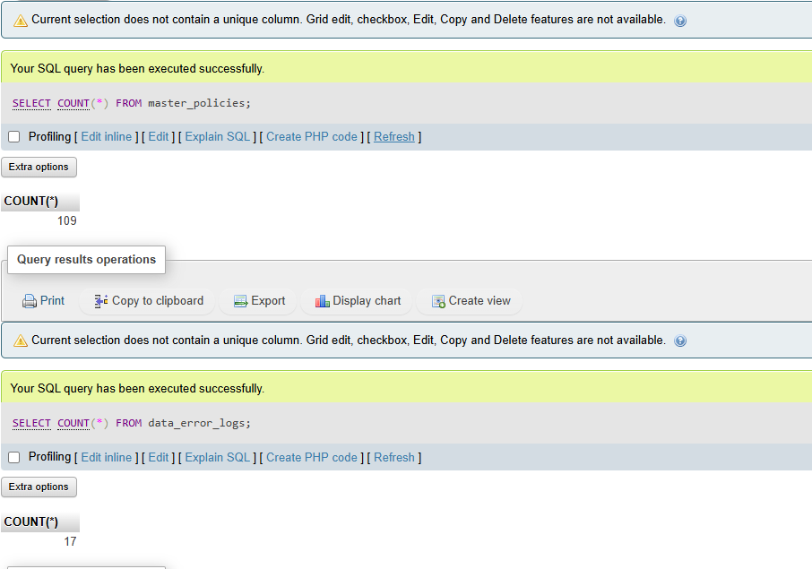

# 🚀 InsureData: Automated ETL & Data Quality Pipeline for Insurance Data

## 📌 Project Overview

InsureData is a SQL-based data engineering project that simulates a real-world **ETL (Extract, Transform, Load) pipeline** for processing insurance policy data.

The system ingests raw, inconsistent data into a staging layer, applies transformation and validation logic using stored procedures, and outputs:

* ✅ Cleaned data into a **master table**
* ✅ Invalid or anomalous records into an **audit/error log table**

This project demonstrates practical skills in **data engineering, SQL development, and data quality management**.

---

## 🧠 Problem Statement

Real-world data is often:

* **Incomplete** (missing values)
* **Inconsistent** (different formats, casing)
* **Invalid** (wrong data types, incorrect dates)
* **Noisy** (duplicates, extreme values)

This project simulates these challenges and builds a pipeline to **clean, validate, and structure the data for reliable analytics**.

---

## 🏗️ Architecture

```
Raw Data (Staging Table)
        ↓
ETL Stored Procedure (Validation + Transformation)
        ↓
----------------------------------------
| Clean Data → master_policies         |
| Invalid Data → data_error_logs       |
----------------------------------------
        ↓
Reporting Layer (SQL Views)
```

---

## ⚙️ Tech Stack

| Component    | Details                                                         |
| ------------ | --------------------------------------------------------------- |
| **Database** | MySQL                                                           |
| **Tools**    | phpMyAdmin /                                                    |
| **Concepts** | ETL Pipelines, Data Validation, Data Cleaning, SQL Optimization |

---

## 📊 Dataset Description

The dataset includes:

* ✔ Synthetic clean data (~200 rows)
* ✔ Real-world noisy data
* ✔ Edge cases and anomalies

### 🔍 Data Issues Simulated

| Issue                                   | Description        |
| --------------------------------------- | ------------------ |
| Missing values                          | NULL               |
| Invalid numeric formats                 | `'abc'`, `'5k'`    |
| Negative and zero values                | Present            |
| Incorrect date formats                  | Multiple formats   |
| Duplicate records                       | Exact + fuzzy      |
| Extra spaces and casing inconsistencies | Present            |
| Extreme values                          | Very large numbers |
| Unrealistic dates                       | Future / past      |

---

## ⚙️ ETL Pipeline Features

### 🔹 1. Data Transformation

* Standardized customer names using `TRIM()` and `UPPER()`
* Categorized policy types using `CASE` logic

### 🔹 2. Data Validation

* Regex validation for numeric and date formats
* Range checks for premium values
* Null and empty value handling

### 🔹 3. Safe Data Loading

* Only valid records inserted into `master_policies`
* Invalid records redirected to `data_error_logs`

### 🔹 4. Error Logging (Audit Layer)

Each invalid record is logged with:

* Source record ID
* Specific issue description (e.g., `Invalid Premium Format`, `Missing Date`)

---

## 🔁 Data Integrity & Deduplication

* Enforced data integrity using constraints to prevent duplicate policy records
* Ensured only valid and unique data is stored in the master table

---

## 📈 Reporting Layer (SQL Views)

### 🔹 Premium Summary

```sql
SELECT * FROM premium_summary;
```

* Total policies by category
* Total premium per category

---

### 🔹 Monthly Premium Trend

```sql
SELECT * FROM monthly_premium;
```

* Monthly aggregation of premium values

---

## ⚡ Query Optimization

* Implemented indexing on key columns (`policy_category`, `start_date`) to improve query performance
* Used `EXPLAIN` to analyze query execution and validate performance improvements

---

## ▶️ How to Run the Project

### Step 1: Create Tables

Run the schema creation script.

### Step 2: Insert Data

Execute the dataset script (clean + noisy data).

### Step 3: Run ETL Pipeline

```sql
CALL Run_Insurance_ETL();
```

### Step 4: Validate Results

```sql
SELECT * FROM master_policies;
SELECT * FROM data_error_logs;
```

### Step 5: View Reports

```sql
SELECT * FROM premium_summary;
SELECT * FROM monthly_premium;
```

---

## 📸 Sample Outputs

### 🔹 Raw Data (Staging Table)



### 🔹 Cleaned Data (Master Table)



### 🔹 Error Logs (Invalid Records)



### 🔹 Monthly Premium Trend (View)



### 🔹 Premium Summary by Policy Category (View)



### 🔹 ETL Result Summary (Record Counts)



---

## 🔄 ETL Workflow

1. Raw insurance data is ingested into the staging table
2. Stored procedure performs validation and transformation
3. Valid records are loaded into the master table
4. Invalid records are logged into the error table
5. SQL views generate aggregated business insights

---

## 🧠 Key Learnings

* Designed a multi-layer ETL architecture (Staging → Master → Audit)
* Implemented data validation using regex and conditional logic
* Handled real-world data quality issues
* Built robust error logging mechanisms
* Applied query optimization techniques using indexing

---

## 💼 Business Value

| Benefit                | Description                                    |
| ---------------------- | ---------------------------------------------- |
| **Data Quality**       | Ensures high data quality before analytics     |
| **Accurate Reporting** | Enables accurate reporting and decision-making |
| **Efficiency**         | Reduces manual data cleaning effort            |
| **Auditability**       | Provides traceability of data issues           |

---

## 👩‍💻 Author

**Sadini Thiranja**
BSc (Hons) Data Science Undergraduate
University of Colombo
